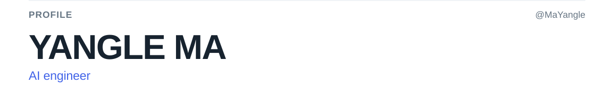
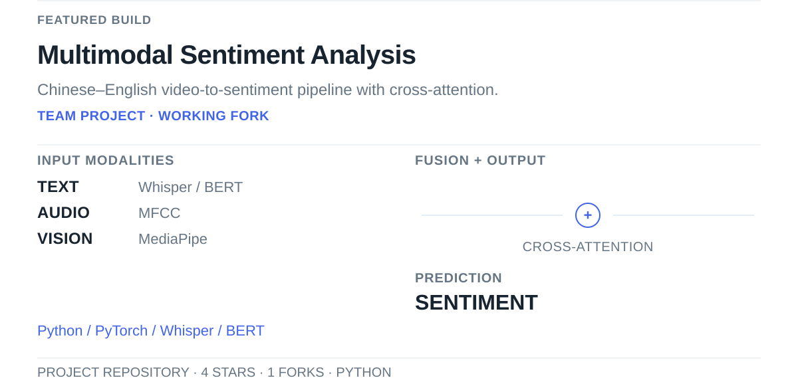
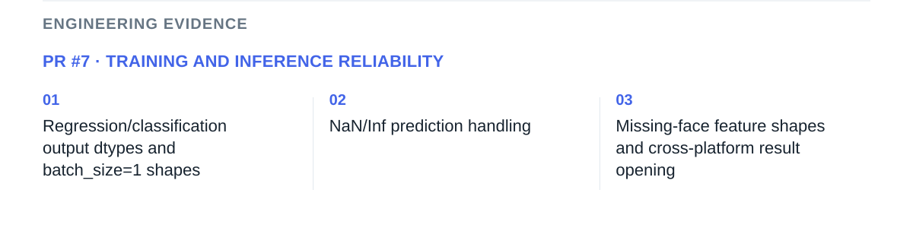
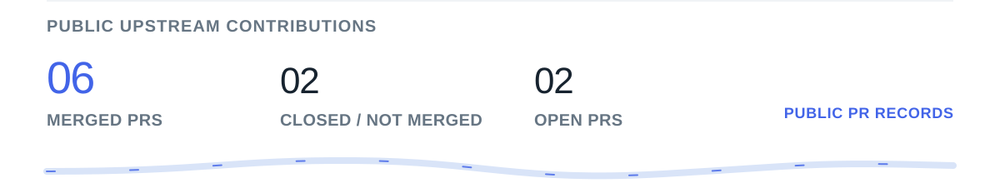
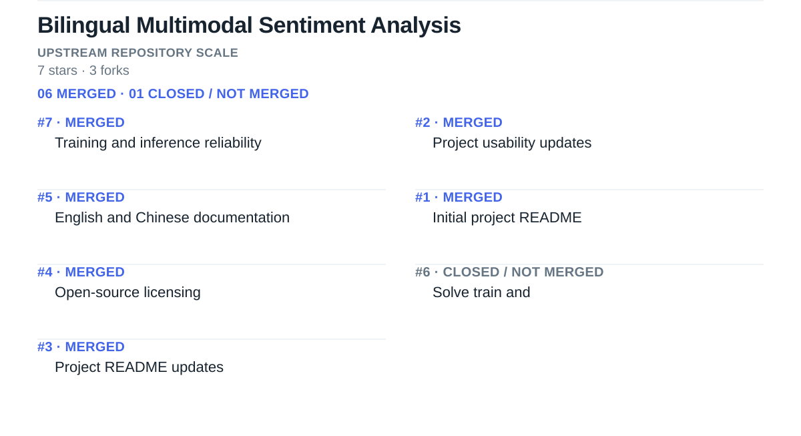
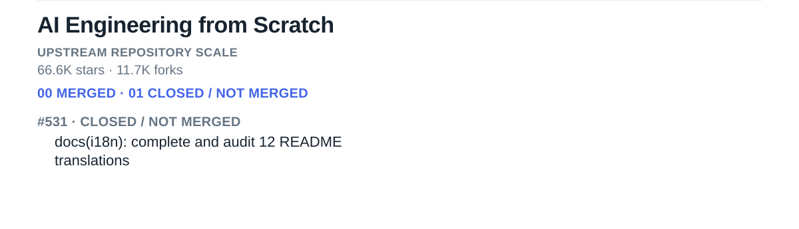
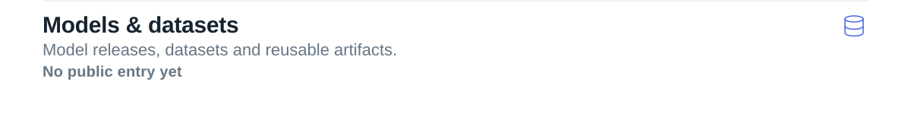

<!-- Generated by scripts/update-profile.mjs. Edit profile.config.json for content. -->

<a href="https://github.com/MaYangle"><picture><source media="(prefers-reduced-motion: reduce) and (max-width: 600px)" srcset="assets/generated/identity-mobile-still.a595d4f26bb7.svg"><source media="(prefers-reduced-motion: reduce)" srcset="assets/generated/identity-still.3bd4ae531d1f.svg"><source media="(max-width: 600px)" srcset="assets/generated/identity-mobile.34f5eaf43d5f.svg"></picture></a>

<a href="https://github.com/MaYangle/Multimodal-Sentiment-Analysis"><picture><source media="(prefers-reduced-motion: reduce) and (max-width: 600px)" srcset="assets/generated/project-1-mobile-still.68e687b48674.svg"><source media="(prefers-reduced-motion: reduce)" srcset="assets/generated/project-1-still.5bdb0efd7f6a.svg"><source media="(max-width: 600px)" srcset="assets/generated/project-1-mobile.26a912ccf28f.svg"></picture></a>

<a href="https://github.com/19376357/Bilingual-Multimodal-Sentiment-Analysis/pull/7"><picture><source media="(prefers-reduced-motion: reduce) and (max-width: 600px)" srcset="assets/generated/engineering-work-1-1-mobile-still.84d6e0726f17.svg"><source media="(prefers-reduced-motion: reduce)" srcset="assets/generated/engineering-work-1-1-still.487bb7ad2e3a.svg"><source media="(max-width: 600px)" srcset="assets/generated/engineering-work-1-1-mobile.79279805050f.svg"></picture></a>

<a href="https://github.com/search?q=author%3AMaYangle%20is%3Apr%20is%3Apublic%20-user%3AMaYangle&amp;type=pullrequests"><picture><source media="(prefers-reduced-motion: reduce) and (max-width: 600px)" srcset="assets/generated/contribution-overview-mobile-still.e1afccc189df.svg"><source media="(prefers-reduced-motion: reduce)" srcset="assets/generated/contribution-overview-still.7390e1b4ad45.svg"><source media="(max-width: 600px)" srcset="assets/generated/contribution-overview-mobile.9d996d5c0da8.svg"></picture></a>

<a href="https://github.com/search?q=author%3AMaYangle%20repo%3A19376357%2FBilingual-Multimodal-Sentiment-Analysis%20is%3Apr%20is%3Aclosed%20is%3Apublic&amp;type=pullrequests"><picture><source media="(prefers-reduced-motion: reduce) and (max-width: 600px)" srcset="assets/generated/contribution-repo-1-mobile-still.f6c192599051.svg"><source media="(prefers-reduced-motion: reduce)" srcset="assets/generated/contribution-repo-1-still.3ea958f50cef.svg"><source media="(max-width: 600px)" srcset="assets/generated/contribution-repo-1-mobile.3804fafeb980.svg"></picture></a>

<a href="https://github.com/search?q=author%3AMaYangle%20repo%3Arohitg00%2Fai-engineering-from-scratch%20is%3Apr%20is%3Aclosed%20is%3Apublic&amp;type=pullrequests"><picture><source media="(prefers-reduced-motion: reduce) and (max-width: 600px)" srcset="assets/generated/contribution-repo-2-mobile-still.622824eb9555.svg"><source media="(prefers-reduced-motion: reduce)" srcset="assets/generated/contribution-repo-2-still.9e9e0eee0945.svg"><source media="(max-width: 600px)" srcset="assets/generated/contribution-repo-2-mobile.82c141d6aee5.svg"></picture></a>

<a href="https://github.com/MaYangle?tab=repositories"><picture><source media="(prefers-reduced-motion: reduce) and (max-width: 600px)" srcset="assets/generated/showcase-1-mobile-still.0f5d9fdb6ffa.svg"><source media="(prefers-reduced-motion: reduce)" srcset="assets/generated/showcase-1-still.ffd60e37525d.svg"><source media="(max-width: 600px)" srcset="assets/generated/showcase-1-mobile.749cac8aad2d.svg"></picture></a>

<a href="https://github.com/MaYangle?tab=repositories"><picture><source media="(prefers-reduced-motion: reduce) and (max-width: 600px)" srcset="assets/generated/showcase-2-mobile-still.aa7f8ae61041.svg"><source media="(prefers-reduced-motion: reduce)" srcset="assets/generated/showcase-2-still.8a669c12a34a.svg"><source media="(max-width: 600px)" srcset="assets/generated/showcase-2-mobile.b8f90cff3561.svg"></picture></a>

<a href="https://github.com/MaYangle?tab=repositories"><picture><source media="(prefers-reduced-motion: reduce) and (max-width: 600px)" srcset="assets/generated/showcase-3-mobile-still.ac8309420c0c.svg"><source media="(prefers-reduced-motion: reduce)" srcset="assets/generated/showcase-3-still.ae137b6c5972.svg"><source media="(max-width: 600px)" srcset="assets/generated/showcase-3-mobile.172e9502a8a8.svg"></picture></a>

<a href="https://github.com/MaYangle?tab=repositories"><picture><source media="(prefers-reduced-motion: reduce) and (max-width: 600px)" srcset="assets/generated/showcase-4-mobile-still.9b8dbd361b22.svg"><source media="(prefers-reduced-motion: reduce)" srcset="assets/generated/showcase-4-still.64cd44add6ee.svg"><source media="(max-width: 600px)" srcset="assets/generated/showcase-4-mobile.175ec9dc4fcd.svg"></picture></a>

<a href="https://github.com/search?q=author%3AMaYangle%20is%3Apr%20is%3Amerged%20is%3Apublic%20-user%3AMaYangle&amp;type=pullrequests"><picture><source media="(prefers-reduced-motion: reduce) and (max-width: 600px)" srcset="assets/generated/impact-mobile-still.3a6d635635d5.svg"><source media="(prefers-reduced-motion: reduce)" srcset="assets/generated/impact-still.fe385a629630.svg"><source media="(max-width: 600px)" srcset="assets/generated/impact-mobile.e3e25f1842a2.svg"></picture></a>

<a href="https://github.com/MaYangle"><picture><source media="(prefers-reduced-motion: reduce) and (max-width: 600px)" srcset="assets/generated/footer-mobile-still.7b0e9d5cee3b.svg"><source media="(prefers-reduced-motion: reduce)" srcset="assets/generated/footer-still.c1faeb204f02.svg"><source media="(max-width: 600px)" srcset="assets/generated/footer-mobile.d7c09c00ef0d.svg"></picture></a>

<a href="https://www.linkedin.com/in/yangle-ma-84877a294/">LinkedIn</a> · <a href="mailto:yanglema44@gmail.com">Email</a>

