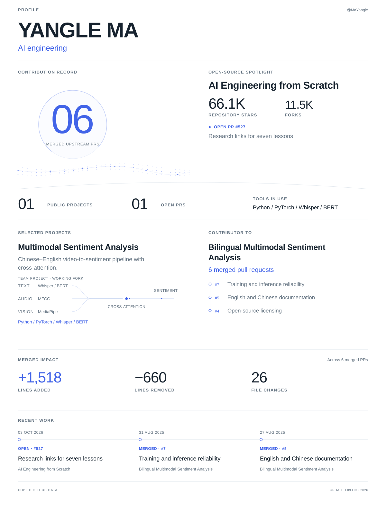

<!-- Generated by scripts/update-profile.mjs. Edit profile.config.json for content. -->
<picture>
  <source media="(prefers-reduced-motion: reduce) and (max-width: 600px)" srcset="assets/generated/profile-mobile-still.7499be64bf83.svg">
  <source media="(prefers-reduced-motion: reduce)" srcset="assets/generated/profile-still.fe011cd02ce8.svg">
  <source media="(max-width: 600px)" srcset="assets/generated/profile-mobile.3dd1afccb5d9.svg">
  
</picture>

[PR #527](https://github.com/rohitg00/ai-engineering-from-scratch/pull/527) · [Multimodal Sentiment Analysis](https://github.com/MaYangle/Multimodal-Sentiment-Analysis) · [All projects](https://github.com/MaYangle?tab=repositories) · [Merged contributions](https://github.com/search?q=author%3AMaYangle%20is%3Apr%20is%3Amerged%20is%3Apublic%20-user%3AMaYangle&type=pullrequests)

[LinkedIn](https://www.linkedin.com/in/yangle-ma-84877a294/) · [Email](mailto:yanglema44@gmail.com)
