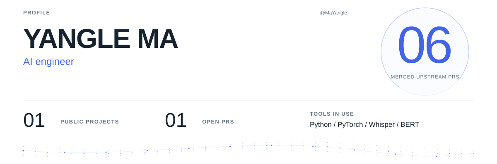
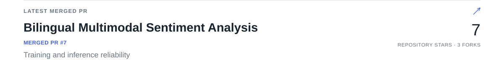
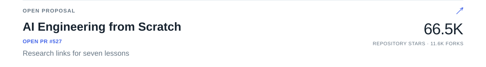
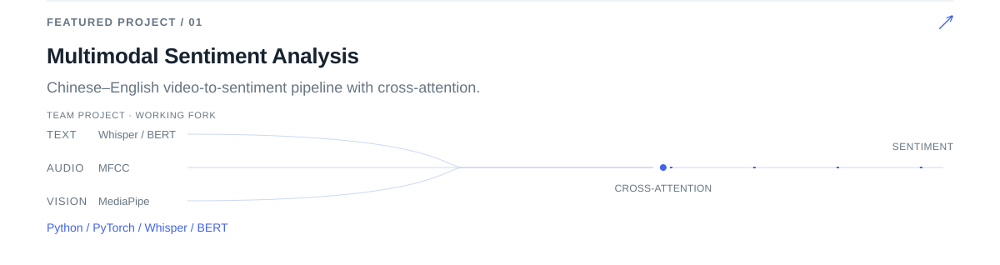
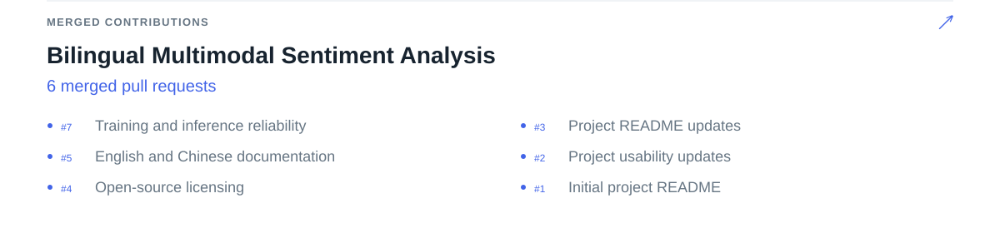
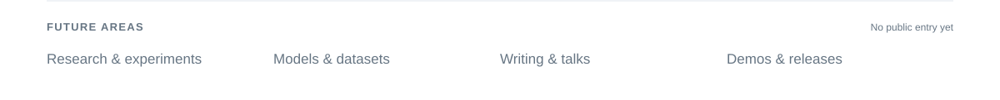
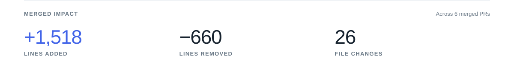
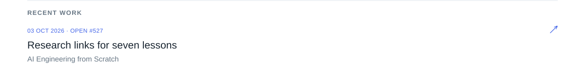
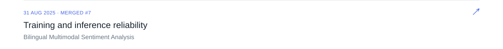
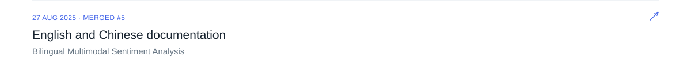

<!-- Generated by scripts/update-profile.mjs. Edit profile.config.json for content. -->

<picture>
  <source media="(prefers-reduced-motion: reduce) and (max-width: 600px)" srcset="assets/generated/profile-mobile-still.685d6fccf567.svg">
  <source media="(prefers-reduced-motion: reduce)" srcset="assets/generated/profile-still.363eeee10185.svg">
  <source media="(max-width: 600px)" srcset="assets/generated/profile-mobile.aad0c92da21e.svg">
  
</picture>

<a href="https://github.com/19376357/Bilingual-Multimodal-Sentiment-Analysis/pull/7">
<picture>
  <source media="(prefers-reduced-motion: reduce) and (max-width: 600px)" srcset="assets/generated/merged-pr-mobile-still.c1d4c7976b84.svg">
  <source media="(prefers-reduced-motion: reduce)" srcset="assets/generated/merged-pr-still.559832a1de3e.svg">
  <source media="(max-width: 600px)" srcset="assets/generated/merged-pr-mobile.b94c9544f06f.svg">
  
</picture>
</a>

<a href="https://github.com/rohitg00/ai-engineering-from-scratch/pull/527">
<picture>
  <source media="(prefers-reduced-motion: reduce) and (max-width: 600px)" srcset="assets/generated/open-pr-mobile-still.6ec06a7d7c64.svg">
  <source media="(prefers-reduced-motion: reduce)" srcset="assets/generated/open-pr-still.f4f78ca7ac83.svg">
  <source media="(max-width: 600px)" srcset="assets/generated/open-pr-mobile.cd03d114ef61.svg">
  
</picture>
</a>

<a href="https://github.com/MaYangle/Multimodal-Sentiment-Analysis">
<picture>
  <source media="(prefers-reduced-motion: reduce) and (max-width: 600px)" srcset="assets/generated/project-1-mobile-still.b2fea0142a3d.svg">
  <source media="(prefers-reduced-motion: reduce)" srcset="assets/generated/project-1-still.79667820fb9a.svg">
  <source media="(max-width: 600px)" srcset="assets/generated/project-1-mobile.488759e03329.svg">
  
</picture>
</a>

<a href="https://github.com/19376357/Bilingual-Multimodal-Sentiment-Analysis">
<picture>
  <source media="(prefers-reduced-motion: reduce) and (max-width: 600px)" srcset="assets/generated/contribution-1-mobile-still.bea4dab1a9e0.svg">
  <source media="(prefers-reduced-motion: reduce)" srcset="assets/generated/contribution-1-still.8a44b25fa41a.svg">
  <source media="(max-width: 600px)" srcset="assets/generated/contribution-1-mobile.2ad7342db49a.svg">
  
</picture>
</a>

<picture>
  <source media="(prefers-reduced-motion: reduce) and (max-width: 600px)" srcset="assets/generated/future-areas-mobile-still.aaa7e7579561.svg">
  <source media="(prefers-reduced-motion: reduce)" srcset="assets/generated/future-areas-still.1bd09355d562.svg">
  <source media="(max-width: 600px)" srcset="assets/generated/future-areas-mobile.fd65fc632387.svg">
  
</picture>

<picture>
  <source media="(prefers-reduced-motion: reduce) and (max-width: 600px)" srcset="assets/generated/impact-mobile-still.360b220a0c42.svg">
  <source media="(prefers-reduced-motion: reduce)" srcset="assets/generated/impact-still.c7d0bae27490.svg">
  <source media="(max-width: 600px)" srcset="assets/generated/impact-mobile.38d51db5fdbc.svg">
  
</picture>

<a href="https://github.com/rohitg00/ai-engineering-from-scratch/pull/527">
<picture>
  <source media="(prefers-reduced-motion: reduce) and (max-width: 600px)" srcset="assets/generated/activity-1-mobile-still.b9f66126fc63.svg">
  <source media="(prefers-reduced-motion: reduce)" srcset="assets/generated/activity-1-still.a56b9ca1d5e7.svg">
  <source media="(max-width: 600px)" srcset="assets/generated/activity-1-mobile.140862b9e7f3.svg">
  
</picture>
</a>

<a href="https://github.com/19376357/Bilingual-Multimodal-Sentiment-Analysis/pull/7">
<picture>
  <source media="(prefers-reduced-motion: reduce) and (max-width: 600px)" srcset="assets/generated/activity-2-mobile-still.59e43be72ad9.svg">
  <source media="(prefers-reduced-motion: reduce)" srcset="assets/generated/activity-2-still.a6d3a73b9911.svg">
  <source media="(max-width: 600px)" srcset="assets/generated/activity-2-mobile.fc9e4ccb5563.svg">
  
</picture>
</a>

<a href="https://github.com/19376357/Bilingual-Multimodal-Sentiment-Analysis/pull/5">
<picture>
  <source media="(prefers-reduced-motion: reduce) and (max-width: 600px)" srcset="assets/generated/activity-3-mobile-still.4ba718ab07ac.svg">
  <source media="(prefers-reduced-motion: reduce)" srcset="assets/generated/activity-3-still.2d78488532d4.svg">
  <source media="(max-width: 600px)" srcset="assets/generated/activity-3-mobile.5ab7739e9d14.svg">
  
</picture>
</a>

<picture>
  <source media="(prefers-reduced-motion: reduce) and (max-width: 600px)" srcset="assets/generated/footer-mobile-still.d3f0b53b405b.svg">
  <source media="(prefers-reduced-motion: reduce)" srcset="assets/generated/footer-still.019992d6448b.svg">
  <source media="(max-width: 600px)" srcset="assets/generated/footer-mobile.9293047a8222.svg">
  
</picture>

[LinkedIn](https://www.linkedin.com/in/yangle-ma-84877a294/) · [Email](mailto:yanglema44@gmail.com)
