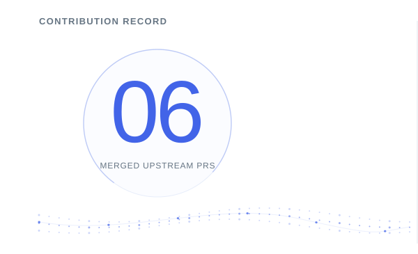
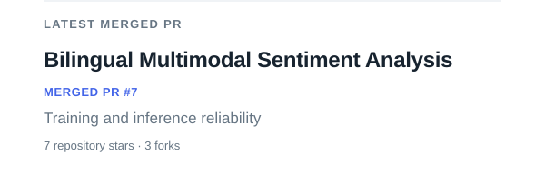
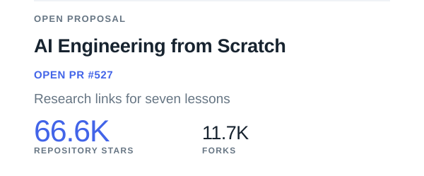
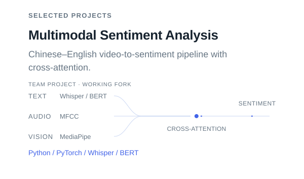
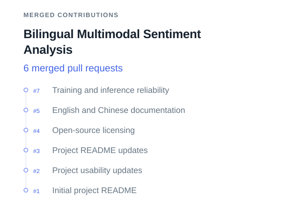
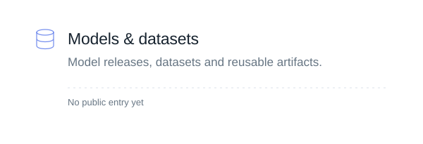
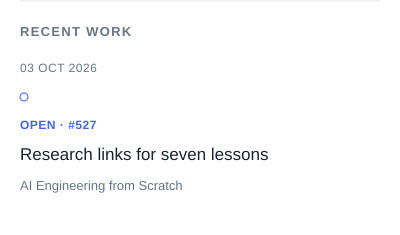
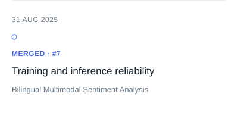
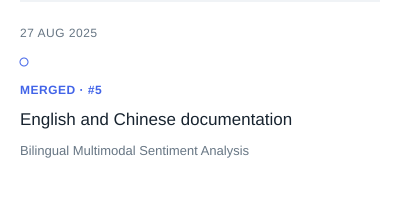

<!-- Generated by scripts/update-profile.mjs. Edit profile.config.json for content. -->

<a href="https://github.com/MaYangle"><picture><source media="(prefers-reduced-motion: reduce) and (max-width: 600px)" srcset="assets/generated/identity-mobile-still.f2e0e6d3afbe.svg"><source media="(prefers-reduced-motion: reduce)" srcset="assets/generated/identity-still.f2e0e6d3afbe.svg"><source media="(max-width: 600px)" srcset="assets/generated/identity-mobile.a64518556525.svg"></picture></a>

<table role="presentation" width="100%" border="0" cellpadding="0" cellspacing="0"><tbody><tr><td width="50%" valign="top"><a href="https://github.com/search?q=author%3AMaYangle%20is%3Apr%20is%3Amerged%20is%3Apublic%20-user%3AMaYangle&amp;type=pullrequests"><picture><source media="(prefers-reduced-motion: reduce) and (max-width: 600px)" srcset="assets/generated/contribution-record-mobile-still.c087d65497ba.svg"><source media="(prefers-reduced-motion: reduce)" srcset="assets/generated/contribution-record-still.4a4198ef4dbc.svg"><source media="(max-width: 600px)" srcset="assets/generated/contribution-record-mobile.b8a71ef1ffc1.svg"></picture></a></td><td width="50%" valign="top"><a href="https://github.com/19376357/Bilingual-Multimodal-Sentiment-Analysis/pull/7"><picture><source media="(prefers-reduced-motion: reduce) and (max-width: 600px)" srcset="assets/generated/spotlight-mobile-still.a47f8aadd3ff.svg"><source media="(prefers-reduced-motion: reduce)" srcset="assets/generated/spotlight-still.37744160f7d7.svg"><source media="(max-width: 600px)" srcset="assets/generated/spotlight-mobile.084899171eda.svg"></picture></a> <a href="https://github.com/rohitg00/ai-engineering-from-scratch/pull/527"><picture><source media="(prefers-reduced-motion: reduce) and (max-width: 600px)" srcset="assets/generated/open-proposal-mobile-still.adfc29eee839.svg"><source media="(prefers-reduced-motion: reduce)" srcset="assets/generated/open-proposal-still.47cc793c2183.svg"><source media="(max-width: 600px)" srcset="assets/generated/open-proposal-mobile.b78774124ae9.svg"></picture></a></td></tr></tbody></table>

<a href="https://github.com/MaYangle?tab=repositories"><picture><source media="(prefers-reduced-motion: reduce) and (max-width: 600px)" srcset="assets/generated/metrics-mobile-still.a091275ba538.svg"><source media="(prefers-reduced-motion: reduce)" srcset="assets/generated/metrics-still.c5fe23ca4d87.svg"><source media="(max-width: 600px)" srcset="assets/generated/metrics-mobile.a7a0a5150238.svg"></picture></a>

<table role="presentation" width="100%" border="0" cellpadding="0" cellspacing="0"><tbody><tr><td width="50%" valign="top"><a href="https://github.com/MaYangle/Multimodal-Sentiment-Analysis"><picture><source media="(prefers-reduced-motion: reduce) and (max-width: 600px)" srcset="assets/generated/project-1-mobile-still.5318babca2fb.svg"><source media="(prefers-reduced-motion: reduce)" srcset="assets/generated/project-1-still.a4a752681b08.svg"><source media="(max-width: 600px)" srcset="assets/generated/project-1-mobile.62f7dce0b1ae.svg"></picture></a></td><td width="50%" valign="top"><a href="https://github.com/search?q=author%3AMaYangle%20repo%3A19376357%2FBilingual-Multimodal-Sentiment-Analysis%20is%3Apr%20is%3Amerged&amp;type=pullrequests"><picture><source media="(prefers-reduced-motion: reduce) and (max-width: 600px)" srcset="assets/generated/contribution-1-mobile-still.439f2ba6b5e6.svg"><source media="(prefers-reduced-motion: reduce)" srcset="assets/generated/contribution-1-still.47693df33a94.svg"><source media="(max-width: 600px)" srcset="assets/generated/contribution-1-mobile.98399e962416.svg"></picture></a></td></tr></tbody></table>

<table role="presentation" width="100%" border="0" cellpadding="0" cellspacing="0"><tbody><tr><td width="50%" valign="top"><a href="https://github.com/MaYangle?tab=repositories"><picture><source media="(prefers-reduced-motion: reduce) and (max-width: 600px)" srcset="assets/generated/showcase-1-mobile-still.7d6c1eb895c2.svg"><source media="(prefers-reduced-motion: reduce)" srcset="assets/generated/showcase-1-still.c094a3e9675c.svg"><source media="(max-width: 600px)" srcset="assets/generated/showcase-1-mobile.a732699c4cfc.svg"></picture></a></td><td width="50%" valign="top"><a href="https://github.com/MaYangle?tab=repositories"><picture><source media="(prefers-reduced-motion: reduce) and (max-width: 600px)" srcset="assets/generated/showcase-2-mobile-still.14168b2b358a.svg"><source media="(prefers-reduced-motion: reduce)" srcset="assets/generated/showcase-2-still.9568ce6c42c1.svg"><source media="(max-width: 600px)" srcset="assets/generated/showcase-2-mobile.6c9d1e153092.svg"></picture></a></td></tr><tr><td width="50%" valign="top"><a href="https://github.com/MaYangle?tab=repositories"><picture><source media="(prefers-reduced-motion: reduce) and (max-width: 600px)" srcset="assets/generated/showcase-3-mobile-still.fdb1f02ae037.svg"><source media="(prefers-reduced-motion: reduce)" srcset="assets/generated/showcase-3-still.45626e4cef84.svg"><source media="(max-width: 600px)" srcset="assets/generated/showcase-3-mobile.9332b88ddab1.svg"></picture></a></td><td width="50%" valign="top"><a href="https://github.com/MaYangle?tab=repositories"><picture><source media="(prefers-reduced-motion: reduce) and (max-width: 600px)" srcset="assets/generated/showcase-4-mobile-still.3f9af1205ca4.svg"><source media="(prefers-reduced-motion: reduce)" srcset="assets/generated/showcase-4-still.6c166a491d4a.svg"><source media="(max-width: 600px)" srcset="assets/generated/showcase-4-mobile.370a20792868.svg"></picture></a></td></tr></tbody></table>

<a href="https://github.com/search?q=author%3AMaYangle%20is%3Apr%20is%3Amerged%20is%3Apublic%20-user%3AMaYangle&amp;type=pullrequests"><picture><source media="(prefers-reduced-motion: reduce) and (max-width: 600px)" srcset="assets/generated/impact-mobile-still.c68d7a498f16.svg"><source media="(prefers-reduced-motion: reduce)" srcset="assets/generated/impact-still.142a26a295d0.svg"><source media="(max-width: 600px)" srcset="assets/generated/impact-mobile.332f95524400.svg"></picture></a>

<table role="presentation" width="100%" border="0" cellpadding="0" cellspacing="0"><tbody><tr><td width="33%" valign="top"><a href="https://github.com/rohitg00/ai-engineering-from-scratch/pull/527"><picture><source media="(prefers-reduced-motion: reduce) and (max-width: 600px)" srcset="assets/generated/activity-1-mobile-still.567fe6dba5fe.svg"><source media="(prefers-reduced-motion: reduce)" srcset="assets/generated/activity-1-still.998e3444dd56.svg"><source media="(max-width: 600px)" srcset="assets/generated/activity-1-mobile.7cef4547b8b3.svg"></picture></a></td><td width="33%" valign="top"><a href="https://github.com/19376357/Bilingual-Multimodal-Sentiment-Analysis/pull/7"><picture><source media="(prefers-reduced-motion: reduce) and (max-width: 600px)" srcset="assets/generated/activity-2-mobile-still.f7c2b888f3c0.svg"><source media="(prefers-reduced-motion: reduce)" srcset="assets/generated/activity-2-still.eb127d765baa.svg"><source media="(max-width: 600px)" srcset="assets/generated/activity-2-mobile.4789d8f49bf4.svg"></picture></a></td><td width="33%" valign="top"><a href="https://github.com/19376357/Bilingual-Multimodal-Sentiment-Analysis/pull/5"><picture><source media="(prefers-reduced-motion: reduce) and (max-width: 600px)" srcset="assets/generated/activity-3-mobile-still.6061f3a27bc1.svg"><source media="(prefers-reduced-motion: reduce)" srcset="assets/generated/activity-3-still.29397ad5a380.svg"><source media="(max-width: 600px)" srcset="assets/generated/activity-3-mobile.d5b27a5caf27.svg"></picture></a></td></tr></tbody></table>

<a href="https://github.com/MaYangle"><picture><source media="(prefers-reduced-motion: reduce) and (max-width: 600px)" srcset="assets/generated/footer-mobile-still.7ccd09d4dd2b.svg"><source media="(prefers-reduced-motion: reduce)" srcset="assets/generated/footer-still.ea88ab856758.svg"><source media="(max-width: 600px)" srcset="assets/generated/footer-mobile.912b863adb6f.svg"></picture></a>

[LinkedIn](https://www.linkedin.com/in/yangle-ma-84877a294/) · [Email](mailto:yanglema44@gmail.com)
