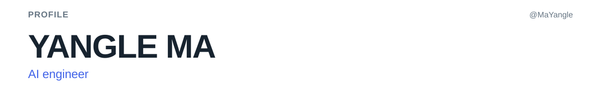
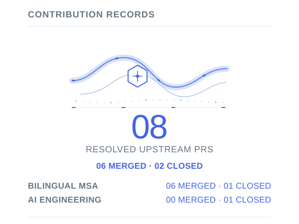
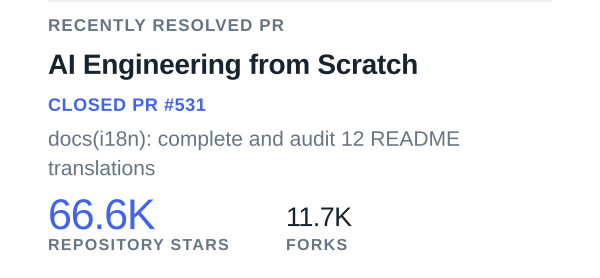
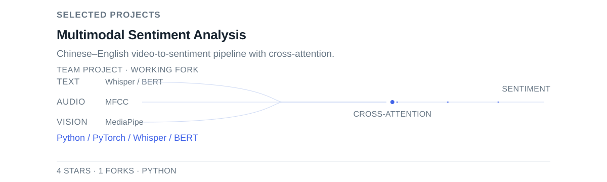
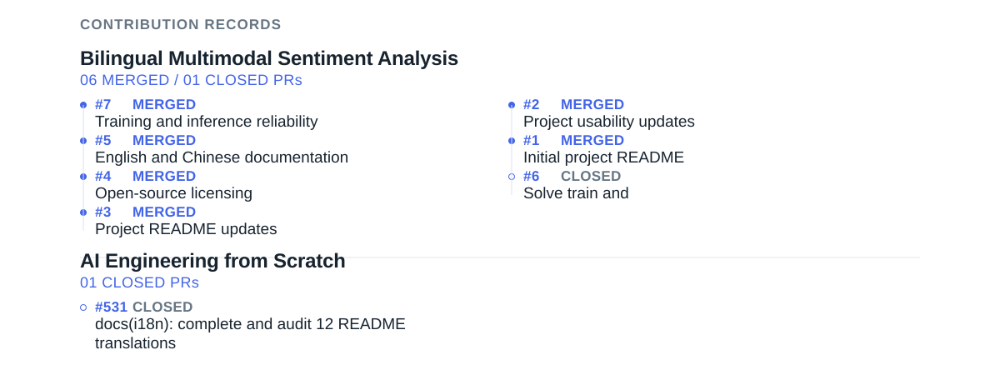
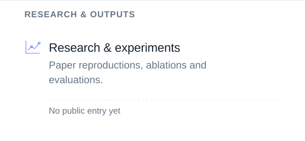
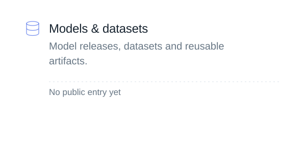

<!-- Generated by scripts/update-profile.mjs. Edit profile.config.json for content. -->

<a href="https://github.com/MaYangle"><picture><source media="(prefers-reduced-motion: reduce) and (max-width: 600px)" srcset="assets/generated/identity-mobile-still.829b43a450db.svg"><source media="(prefers-reduced-motion: reduce)" srcset="assets/generated/identity-still.829b43a450db.svg"><source media="(max-width: 600px)" srcset="assets/generated/identity-mobile.a9362fec920a.svg"></picture></a>

<table role="presentation" width="100%" border="0" cellpadding="0" cellspacing="0"><tbody><tr><td width="50%" valign="top"><a href="https://github.com/search?q=author%3AMaYangle%20is%3Apr%20is%3Aclosed%20is%3Apublic%20-user%3AMaYangle&amp;type=pullrequests"><picture><source media="(prefers-reduced-motion: reduce) and (max-width: 600px)" srcset="assets/generated/contribution-record-mobile-still.e47e9f59c9a6.svg"><source media="(prefers-reduced-motion: reduce)" srcset="assets/generated/contribution-record-still.ebd574a97675.svg"><source media="(max-width: 600px)" srcset="assets/generated/contribution-record-mobile.3650f53784b5.svg"></picture></a></td><td width="50%" valign="top"><a href="https://github.com/19376357/Bilingual-Multimodal-Sentiment-Analysis/pull/7"><picture><source media="(prefers-reduced-motion: reduce) and (max-width: 600px)" srcset="assets/generated/spotlight-mobile-still.f951cbcd3eb2.svg"><source media="(prefers-reduced-motion: reduce)" srcset="assets/generated/spotlight-still.b8e77ff2e03b.svg"><source media="(max-width: 600px)" srcset="assets/generated/spotlight-mobile.70dd3d32caae.svg"></picture></a> <a href="https://github.com/rohitg00/ai-engineering-from-scratch/pull/531"><picture><source media="(prefers-reduced-motion: reduce) and (max-width: 600px)" srcset="assets/generated/resolved-pr-mobile-still.ff95cb02652e.svg"><source media="(prefers-reduced-motion: reduce)" srcset="assets/generated/resolved-pr-still.0ad85eef2517.svg"><source media="(max-width: 600px)" srcset="assets/generated/resolved-pr-mobile.6b9999f06c53.svg"></picture></a></td></tr></tbody></table>

<a href="https://github.com/MaYangle?tab=repositories"><picture><source media="(prefers-reduced-motion: reduce) and (max-width: 600px)" srcset="assets/generated/metrics-mobile-still.fc61204e1e1c.svg"><source media="(prefers-reduced-motion: reduce)" srcset="assets/generated/metrics-still.3188874e8947.svg"><source media="(max-width: 600px)" srcset="assets/generated/metrics-mobile.c9fb6e42bf2d.svg"></picture></a>

<a href="https://github.com/MaYangle/Multimodal-Sentiment-Analysis"><picture><source media="(prefers-reduced-motion: reduce) and (max-width: 600px)" srcset="assets/generated/project-1-mobile-still.551b56af5fe8.svg"><source media="(prefers-reduced-motion: reduce)" srcset="assets/generated/project-1-still.d54b6815514a.svg"><source media="(max-width: 600px)" srcset="assets/generated/project-1-mobile.dce55b7c22dd.svg"></picture></a>

<a href="https://github.com/search?q=author%3AMaYangle%20is%3Apr%20is%3Aclosed%20is%3Apublic%20-user%3AMaYangle&amp;type=pullrequests"><picture><source media="(prefers-reduced-motion: reduce) and (max-width: 600px)" srcset="assets/generated/contribution-records-mobile-still.400cb3944fd8.svg"><source media="(prefers-reduced-motion: reduce)" srcset="assets/generated/contribution-records-still.6625304c9a58.svg"><source media="(max-width: 600px)" srcset="assets/generated/contribution-records-mobile.04e0369a3a05.svg"></picture></a>

<table role="presentation" width="100%" border="0" cellpadding="0" cellspacing="0"><tbody><tr><td width="50%" valign="top"><a href="https://github.com/MaYangle?tab=repositories"><picture><source media="(prefers-reduced-motion: reduce) and (max-width: 600px)" srcset="assets/generated/showcase-1-mobile-still.abb10b72b034.svg"><source media="(prefers-reduced-motion: reduce)" srcset="assets/generated/showcase-1-still.4420ed74bcdd.svg"><source media="(max-width: 600px)" srcset="assets/generated/showcase-1-mobile.0126d5efe962.svg"></picture></a></td><td width="50%" valign="top"><a href="https://github.com/MaYangle?tab=repositories"><picture><source media="(prefers-reduced-motion: reduce) and (max-width: 600px)" srcset="assets/generated/showcase-2-mobile-still.32e79ef17aeb.svg"><source media="(prefers-reduced-motion: reduce)" srcset="assets/generated/showcase-2-still.34ada4f6155a.svg"><source media="(max-width: 600px)" srcset="assets/generated/showcase-2-mobile.938a99614fc7.svg"></picture></a></td></tr></tbody></table>
<table role="presentation" width="100%" border="0" cellpadding="0" cellspacing="0"><tbody><tr><td width="50%" valign="top"><a href="https://github.com/MaYangle?tab=repositories"><picture><source media="(prefers-reduced-motion: reduce) and (max-width: 600px)" srcset="assets/generated/showcase-3-mobile-still.316590e809e7.svg"><source media="(prefers-reduced-motion: reduce)" srcset="assets/generated/showcase-3-still.c79b189f81d6.svg"><source media="(max-width: 600px)" srcset="assets/generated/showcase-3-mobile.44fc83b235a7.svg"></picture></a></td><td width="50%" valign="top"><a href="https://github.com/MaYangle?tab=repositories"><picture><source media="(prefers-reduced-motion: reduce) and (max-width: 600px)" srcset="assets/generated/showcase-4-mobile-still.87c89475ce83.svg"><source media="(prefers-reduced-motion: reduce)" srcset="assets/generated/showcase-4-still.559a8dd293a4.svg"><source media="(max-width: 600px)" srcset="assets/generated/showcase-4-mobile.7e6e86fd0ee9.svg"></picture></a></td></tr></tbody></table>

<a href="https://github.com/search?q=author%3AMaYangle%20is%3Apr%20is%3Amerged%20is%3Apublic%20-user%3AMaYangle&amp;type=pullrequests"><picture><source media="(prefers-reduced-motion: reduce) and (max-width: 600px)" srcset="assets/generated/impact-mobile-still.51f84b45ce9d.svg"><source media="(prefers-reduced-motion: reduce)" srcset="assets/generated/impact-still.a665328bcc08.svg"><source media="(max-width: 600px)" srcset="assets/generated/impact-mobile.eefd62a6efb0.svg"></picture></a>

<a href="https://github.com/MaYangle"><picture><source media="(prefers-reduced-motion: reduce) and (max-width: 600px)" srcset="assets/generated/footer-mobile-still.91fdf8e12684.svg"><source media="(prefers-reduced-motion: reduce)" srcset="assets/generated/footer-still.e82cf6ecd4d6.svg"><source media="(max-width: 600px)" srcset="assets/generated/footer-mobile.1f108d73dbe4.svg"></picture></a>

[LinkedIn](https://www.linkedin.com/in/yangle-ma-84877a294/) · [Email](mailto:yanglema44@gmail.com)

