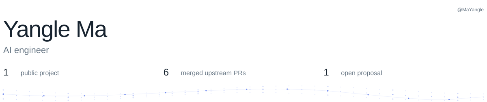
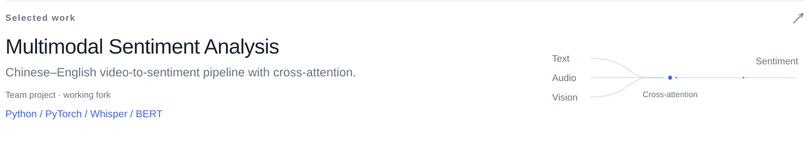
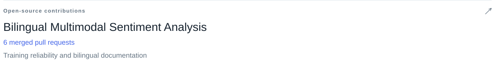
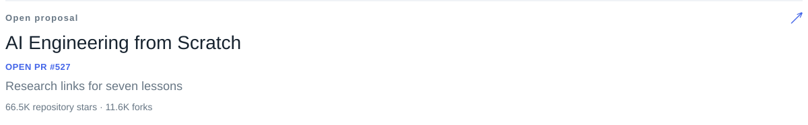
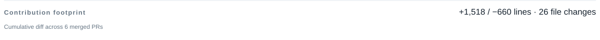
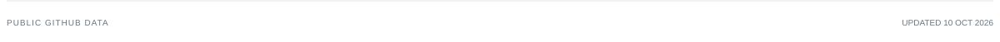

<!-- Generated by scripts/update-profile.mjs. Edit profile.config.json for content. -->

<picture>
  <source media="(prefers-reduced-motion: reduce) and (max-width: 600px)" srcset="assets/generated/profile-mobile-still.e845004a8b98.svg">
  <source media="(prefers-reduced-motion: reduce)" srcset="assets/generated/profile-still.b7546bbbe441.svg">
  <source media="(max-width: 600px)" srcset="assets/generated/profile-mobile.f0f6f8ccc531.svg">
  
</picture>

<a href="https://github.com/MaYangle/Multimodal-Sentiment-Analysis">
<picture>
  <source media="(prefers-reduced-motion: reduce) and (max-width: 600px)" srcset="assets/generated/project-1-mobile-still.decc3e4de8a2.svg">
  <source media="(prefers-reduced-motion: reduce)" srcset="assets/generated/project-1-still.26604f8ce618.svg">
  <source media="(max-width: 600px)" srcset="assets/generated/project-1-mobile.c4269a6b5875.svg">
  
</picture>
</a>

<a href="https://github.com/19376357/Bilingual-Multimodal-Sentiment-Analysis">
<picture>
  <source media="(prefers-reduced-motion: reduce) and (max-width: 600px)" srcset="assets/generated/contribution-1-mobile-still.431be780d539.svg">
  <source media="(prefers-reduced-motion: reduce)" srcset="assets/generated/contribution-1-still.b02a7fa0d0ac.svg">
  <source media="(max-width: 600px)" srcset="assets/generated/contribution-1-mobile.7ea15405d225.svg">
  
</picture>
</a>

<a href="https://github.com/19376357/Bilingual-Multimodal-Sentiment-Analysis/pull/7">Latest merged · #7: Training and inference reliability</a>

View 6 merged pull requests

- [#7: Training and inference reliability](https://github.com/19376357/Bilingual-Multimodal-Sentiment-Analysis/pull/7)
- [#5: English and Chinese documentation](https://github.com/19376357/Bilingual-Multimodal-Sentiment-Analysis/pull/5)
- [#4: Open-source licensing](https://github.com/19376357/Bilingual-Multimodal-Sentiment-Analysis/pull/4)
- [#3: Project README updates](https://github.com/19376357/Bilingual-Multimodal-Sentiment-Analysis/pull/3)
- [#2: Project usability updates](https://github.com/19376357/Bilingual-Multimodal-Sentiment-Analysis/pull/2)
- [#1: Initial project README](https://github.com/19376357/Bilingual-Multimodal-Sentiment-Analysis/pull/1)

<a href="https://github.com/rohitg00/ai-engineering-from-scratch/pull/527">
<picture>
  <source media="(prefers-reduced-motion: reduce) and (max-width: 600px)" srcset="assets/generated/open-pr-mobile-still.b9eef633a5d5.svg">
  <source media="(prefers-reduced-motion: reduce)" srcset="assets/generated/open-pr-still.d0d02d1b9517.svg">
  <source media="(max-width: 600px)" srcset="assets/generated/open-pr-mobile.bc4fac38c2ef.svg">
  
</picture>
</a>

<picture>
  <source media="(prefers-reduced-motion: reduce) and (max-width: 600px)" srcset="assets/generated/impact-mobile-still.da111807e0f8.svg">
  <source media="(prefers-reduced-motion: reduce)" srcset="assets/generated/impact-still.cbe08bf528cc.svg">
  <source media="(max-width: 600px)" srcset="assets/generated/impact-mobile.59ee624de11b.svg">
  
</picture>

<picture>
  <source media="(prefers-reduced-motion: reduce) and (max-width: 600px)" srcset="assets/generated/footer-mobile-still.9bed16c2ae6a.svg">
  <source media="(prefers-reduced-motion: reduce)" srcset="assets/generated/footer-still.9d829faf5ff1.svg">
  <source media="(max-width: 600px)" srcset="assets/generated/footer-mobile.a1037debb855.svg">
  
</picture>

[LinkedIn](https://www.linkedin.com/in/yangle-ma-84877a294/) · [Email](mailto:yanglema44@gmail.com)
