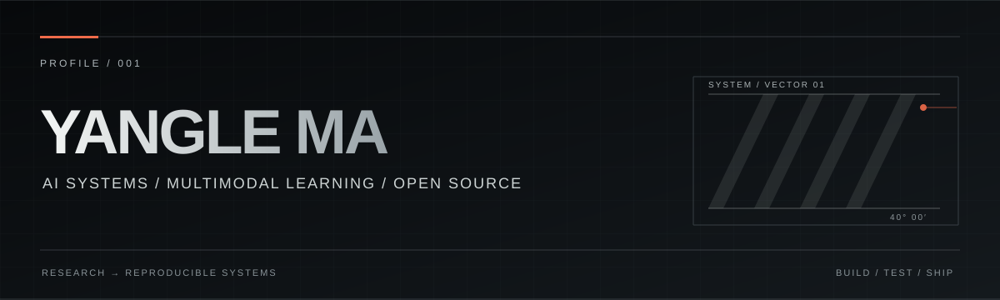
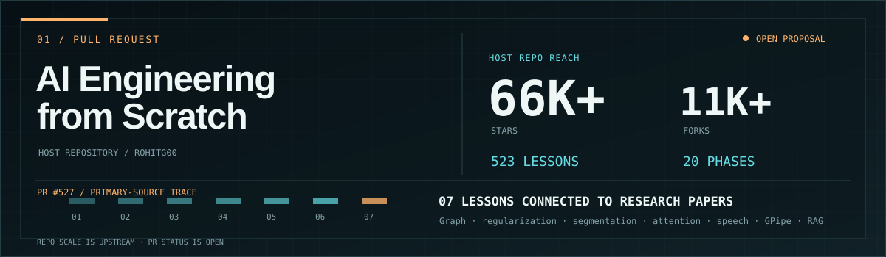
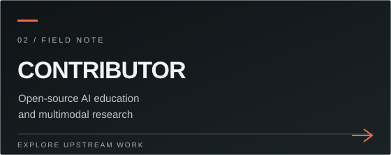
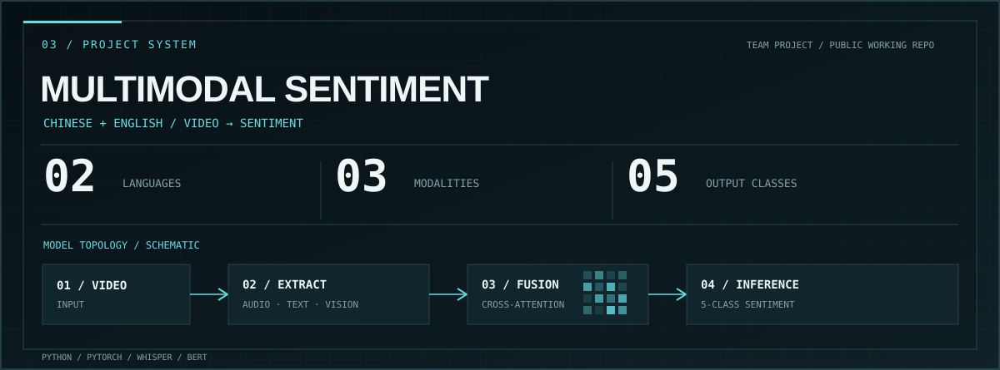

  

  <a href="#pull-request">01 / PULL REQUEST</a> &nbsp;·&nbsp;
  <a href="#contributor-record">02 / CONTRIBUTOR</a> &nbsp;·&nbsp;
  <a href="#project-system">03 / PROJECT</a> &nbsp;·&nbsp;
  <a href="#contact">CONTACT</a>

I’m **Yangle Ma**. I build at the intersection of autonomous systems, multimodal learning, and practical AI engineering. I care about the path from an interesting model to a system others can run, inspect, and learn from.

我关注多模态模型与可靠工程的交点：让研究想法成为可复现、可检查、可分享的系统。

## Pull request

**My work:** [PR #527](https://github.com/rohitg00/ai-engineering-from-scratch/pull/527) proposes primary-paper links for seven existing lessons and short comparison exercises. The PR is **open**. The repository scale shown above belongs to [AI Engineering from Scratch](https://github.com/rohitg00/ai-engineering-from-scratch).

## Contributor record

**Six merged PRs** in the team’s [Bilingual Multimodal Sentiment Analysis](https://github.com/19376357/Bilingual-Multimodal-Sentiment-Analysis) codebase. Selected work: [training and inference fixes #7](https://github.com/19376357/Bilingual-Multimodal-Sentiment-Analysis/pull/7), [English and Chinese documentation #5](https://github.com/19376357/Bilingual-Multimodal-Sentiment-Analysis/pull/5), and [license #4](https://github.com/19376357/Bilingual-Multimodal-Sentiment-Analysis/pull/4).

## Project system

**Cross-lingual Multimodal Sentiment Analysis** is a team-built Chinese–English video-to-sentiment pipeline. It combines speech, text, and visual features with cross-attention; the [public working repository](https://github.com/MaYangle/Multimodal-Sentiment-Analysis) is my fork of the team codebase.

<!-- Next public project: add another full-width project panel here, then a short evidence-based description and repository link. -->

## Contact

[LinkedIn](https://www.linkedin.com/in/yangle-ma-84877a294/) · [Email](mailto:yanglema44@gmail.com) · [All pull requests](https://github.com/search?q=author%3AMaYangle+is%3Apr&type=pullrequests)

Telemetry snapshot: 2026-10-09. Host repository stars and forks are rounded public GitHub figures; merged PR count is from GitHub search. Graphics are static schematics, not live model measurements.
