<!-- Generated by scripts/update-profile.mjs. Edit profile.config.json for content. -->

<a href="https://github.com/MaYangle"><picture><source media="(prefers-reduced-motion: reduce) and (max-width: 600px)" srcset="assets/generated/identity-mobile-still.f2e0e6d3afbe.svg"><source media="(prefers-reduced-motion: reduce)" srcset="assets/generated/identity-still.f2e0e6d3afbe.svg"><source media="(max-width: 600px)" srcset="assets/generated/identity-mobile.a64518556525.svg">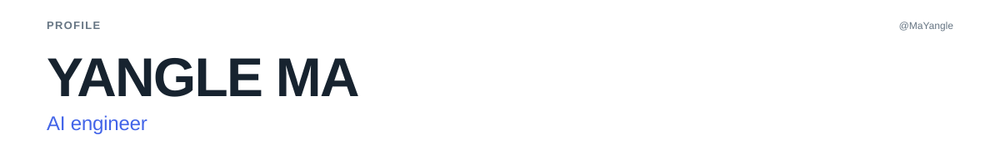</picture></a>

<table role="presentation" width="100%" border="0" cellpadding="0" cellspacing="0"><tbody><tr><td width="50%" valign="top"><a href="https://github.com/search?q=author%3AMaYangle%20is%3Apr%20is%3Amerged%20is%3Apublic%20-user%3AMaYangle&amp;type=pullrequests"><picture><source media="(prefers-reduced-motion: reduce) and (max-width: 600px)" srcset="assets/generated/contribution-record-mobile-still.c4b265ac2b19.svg"><source media="(prefers-reduced-motion: reduce)" srcset="assets/generated/contribution-record-still.709aa470bf06.svg"><source media="(max-width: 600px)" srcset="assets/generated/contribution-record-mobile.82f910e68846.svg">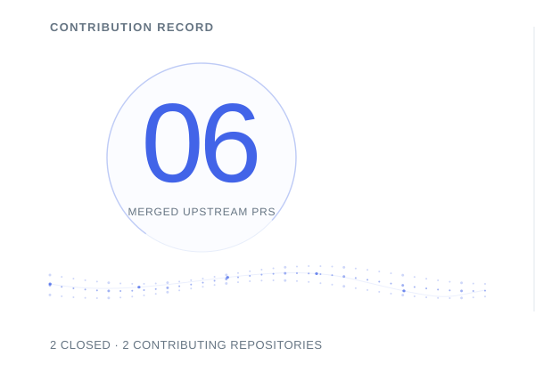</picture></a></td><td width="50%" valign="top"><a href="https://github.com/19376357/Bilingual-Multimodal-Sentiment-Analysis/pull/7"><picture><source media="(prefers-reduced-motion: reduce) and (max-width: 600px)" srcset="assets/generated/spotlight-mobile-still.032e48f5f61d.svg"><source media="(prefers-reduced-motion: reduce)" srcset="assets/generated/spotlight-still.001e583eefbe.svg"><source media="(max-width: 600px)" srcset="assets/generated/spotlight-mobile.6a27e62ddfe8.svg">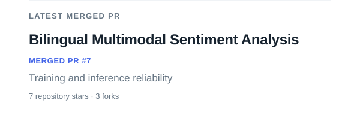</picture></a> <a href="https://github.com/rohitg00/ai-engineering-from-scratch/pull/531"><picture><source media="(prefers-reduced-motion: reduce) and (max-width: 600px)" srcset="assets/generated/resolved-pr-mobile-still.f73654b875b4.svg"><source media="(prefers-reduced-motion: reduce)" srcset="assets/generated/resolved-pr-still.35ec2c26775d.svg"><source media="(max-width: 600px)" srcset="assets/generated/resolved-pr-mobile.0dd94b956188.svg">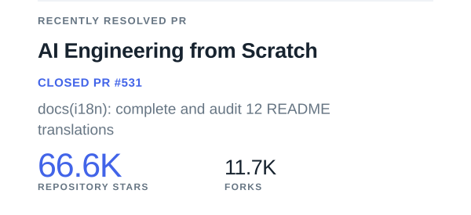</picture></a></td></tr></tbody></table>

<a href="https://github.com/MaYangle?tab=repositories"><picture><source media="(prefers-reduced-motion: reduce) and (max-width: 600px)" srcset="assets/generated/metrics-mobile-still.a091275ba538.svg"><source media="(prefers-reduced-motion: reduce)" srcset="assets/generated/metrics-still.c5fe23ca4d87.svg"><source media="(max-width: 600px)" srcset="assets/generated/metrics-mobile.a7a0a5150238.svg"></picture></a>

<table role="presentation" width="100%" border="0" cellpadding="0" cellspacing="0"><tbody><tr><td width="50%" valign="top"><a href="https://github.com/MaYangle/Multimodal-Sentiment-Analysis"><picture><source media="(prefers-reduced-motion: reduce) and (max-width: 600px)" srcset="assets/generated/project-1-mobile-still.77953c408b45.svg"><source media="(prefers-reduced-motion: reduce)" srcset="assets/generated/project-1-still.5771f226f3a6.svg"><source media="(max-width: 600px)" srcset="assets/generated/project-1-mobile.f21ac64cc6d8.svg">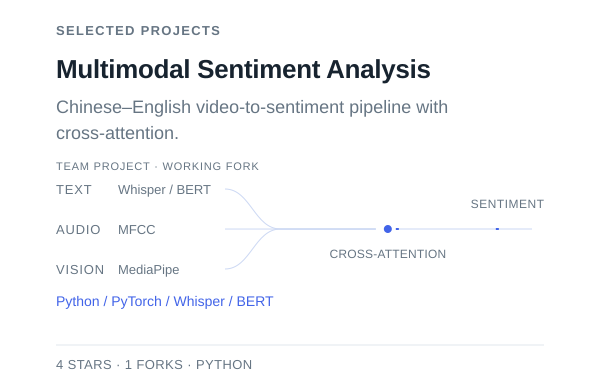</picture></a></td><td width="50%" valign="top"><a href="https://github.com/search?q=author%3AMaYangle%20is%3Apr%20is%3Aclosed%20is%3Apublic%20-user%3AMaYangle&amp;type=pullrequests"><picture><source media="(prefers-reduced-motion: reduce) and (max-width: 600px)" srcset="assets/generated/contribution-records-mobile-still.08c9b9d49f3f.svg"><source media="(prefers-reduced-motion: reduce)" srcset="assets/generated/contribution-records-still.702283c07d1f.svg"><source media="(max-width: 600px)" srcset="assets/generated/contribution-records-mobile.aad9590f1aa3.svg">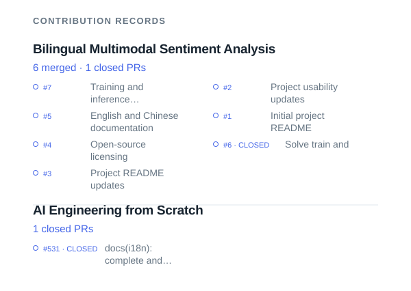</picture></a></td></tr></tbody></table>

<table role="presentation" width="100%" border="0" cellpadding="0" cellspacing="0"><tbody><tr><td width="50%" valign="top"><a href="https://github.com/MaYangle?tab=repositories"><picture><source media="(prefers-reduced-motion: reduce) and (max-width: 600px)" srcset="assets/generated/showcase-1-mobile-still.7d6c1eb895c2.svg"><source media="(prefers-reduced-motion: reduce)" srcset="assets/generated/showcase-1-still.c094a3e9675c.svg"><source media="(max-width: 600px)" srcset="assets/generated/showcase-1-mobile.a732699c4cfc.svg">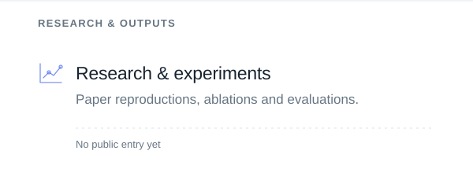</picture></a></td><td width="50%" valign="top"><a href="https://github.com/MaYangle?tab=repositories"><picture><source media="(prefers-reduced-motion: reduce) and (max-width: 600px)" srcset="assets/generated/showcase-2-mobile-still.db5f82080067.svg"><source media="(prefers-reduced-motion: reduce)" srcset="assets/generated/showcase-2-still.82a7e549e376.svg"><source media="(max-width: 600px)" srcset="assets/generated/showcase-2-mobile.0221a49e8bad.svg">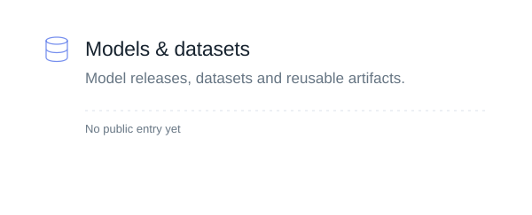</picture></a></td></tr></tbody></table>
<table role="presentation" width="100%" border="0" cellpadding="0" cellspacing="0"><tbody><tr><td width="50%" valign="top"><a href="https://github.com/MaYangle?tab=repositories"><picture><source media="(prefers-reduced-motion: reduce) and (max-width: 600px)" srcset="assets/generated/showcase-3-mobile-still.fdb1f02ae037.svg"><source media="(prefers-reduced-motion: reduce)" srcset="assets/generated/showcase-3-still.45626e4cef84.svg"><source media="(max-width: 600px)" srcset="assets/generated/showcase-3-mobile.9332b88ddab1.svg">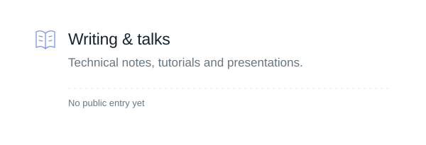</picture></a></td><td width="50%" valign="top"><a href="https://github.com/MaYangle?tab=repositories"><picture><source media="(prefers-reduced-motion: reduce) and (max-width: 600px)" srcset="assets/generated/showcase-4-mobile-still.3f9af1205ca4.svg"><source media="(prefers-reduced-motion: reduce)" srcset="assets/generated/showcase-4-still.6c166a491d4a.svg"><source media="(max-width: 600px)" srcset="assets/generated/showcase-4-mobile.370a20792868.svg">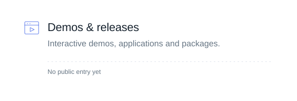</picture></a></td></tr></tbody></table>

<a href="https://github.com/search?q=author%3AMaYangle%20is%3Apr%20is%3Amerged%20is%3Apublic%20-user%3AMaYangle&amp;type=pullrequests"><picture><source media="(prefers-reduced-motion: reduce) and (max-width: 600px)" srcset="assets/generated/impact-mobile-still.c68d7a498f16.svg"><source media="(prefers-reduced-motion: reduce)" srcset="assets/generated/impact-still.142a26a295d0.svg"><source media="(max-width: 600px)" srcset="assets/generated/impact-mobile.332f95524400.svg">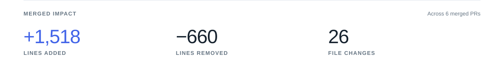</picture></a>

<table role="presentation" width="100%" border="0" cellpadding="0" cellspacing="0"><tbody><tr><td width="33%" valign="top"><a href="https://github.com/rohitg00/ai-engineering-from-scratch/pull/531"><picture><source media="(prefers-reduced-motion: reduce) and (max-width: 600px)" srcset="assets/generated/activity-1-mobile-still.f1855498bfec.svg"><source media="(prefers-reduced-motion: reduce)" srcset="assets/generated/activity-1-still.4a6e85dc5fe6.svg"><source media="(max-width: 600px)" srcset="assets/generated/activity-1-mobile.3a63dffb9b01.svg">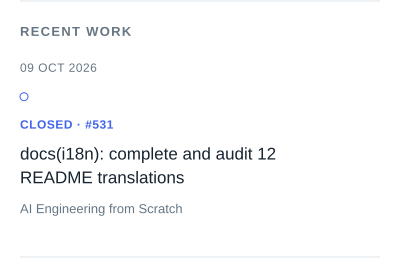</picture></a></td><td width="33%" valign="top"><a href="https://github.com/19376357/Bilingual-Multimodal-Sentiment-Analysis/pull/7"><picture><source media="(prefers-reduced-motion: reduce) and (max-width: 600px)" srcset="assets/generated/activity-2-mobile-still.3916f89d5fdc.svg"><source media="(prefers-reduced-motion: reduce)" srcset="assets/generated/activity-2-still.bd24ce09ff30.svg"><source media="(max-width: 600px)" srcset="assets/generated/activity-2-mobile.f7b57b5c4ed7.svg">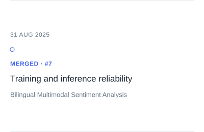</picture></a></td><td width="33%" valign="top"><a href="https://github.com/19376357/Bilingual-Multimodal-Sentiment-Analysis/pull/6"><picture><source media="(prefers-reduced-motion: reduce) and (max-width: 600px)" srcset="assets/generated/activity-3-mobile-still.e02019078786.svg"><source media="(prefers-reduced-motion: reduce)" srcset="assets/generated/activity-3-still.193d26dbf880.svg"><source media="(max-width: 600px)" srcset="assets/generated/activity-3-mobile.525baeacceb3.svg">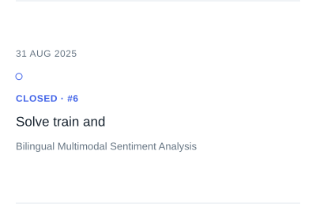</picture></a></td></tr></tbody></table>

<a href="https://github.com/MaYangle"><picture><source media="(prefers-reduced-motion: reduce) and (max-width: 600px)" srcset="assets/generated/footer-mobile-still.7ccd09d4dd2b.svg"><source media="(prefers-reduced-motion: reduce)" srcset="assets/generated/footer-still.ea88ab856758.svg"><source media="(max-width: 600px)" srcset="assets/generated/footer-mobile.912b863adb6f.svg"></picture></a>

[LinkedIn](https://www.linkedin.com/in/yangle-ma-84877a294/) · [Email](mailto:yanglema44@gmail.com)
