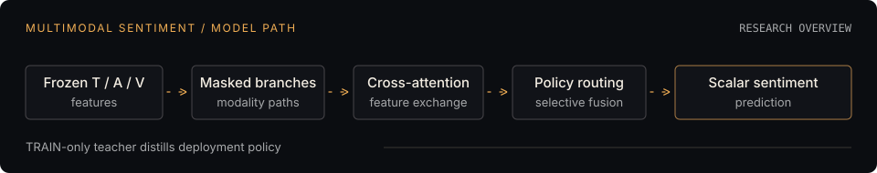

<!-- Generated from profile.config.json and public GitHub data. -->

<a href="https://github.com/search?q=author%3AMaYangle%20is%3Apr%20is%3Apublic%20-user%3AMaYangle%20is%3Amerged&amp;type=pullrequests"><picture><source media="(prefers-reduced-motion: reduce) and (max-width: 600px)" srcset="assets/generated/summary-mobile-still.1b0758d83cae.svg"><source media="(prefers-reduced-motion: reduce)" srcset="assets/generated/summary-still.f53180dd9369.svg"><source media="(max-width: 600px)" srcset="assets/generated/summary-mobile.754c45f68079.svg"></picture></a>

**AI engineer · Multimodal learning &amp; reproducible experiments**

I build and evaluate multimodal learning systems, from text/audio/vision pipelines to controlled fusion experiments. I care about reproducible runs, clear evaluation boundaries and useful upstream fixes.

[LinkedIn](https://www.linkedin.com/in/yangle-ma-84877a294/) · [Email](mailto:yanglema44@gmail.com)

## Research & engineering

### [Multimodal Sentiment Fusion](https://github.com/MaYangle/Multimodal-Sentiment-Fusion)

A Python/PyTorch research codebase for native continuous sentiment prediction on CH-SIMS v2.0 and CMU-MOSEI, with sequence fusion, matched controls, resumable training and independent evaluation.

[Architecture](https://github.com/MaYangle/Multimodal-Sentiment-Fusion/blob/main/docs/ARCHITECTURE.md) · [Experiments](https://github.com/MaYangle/Multimodal-Sentiment-Fusion/blob/main/docs/EXPERIMENTS.md) · [Reproduce](https://github.com/MaYangle/Multimodal-Sentiment-Fusion/blob/main/docs/REPRODUCING.md)

<a href="https://github.com/MaYangle/Multimodal-Sentiment-Fusion/blob/main/docs/ARCHITECTURE.md"><picture><source media="(prefers-reduced-motion: reduce) and (max-width: 600px)" srcset="assets/generated/research-mobile-still.1fe95344fc57.svg"><source media="(prefers-reduced-motion: reduce)" srcset="assets/generated/research-still.fe343d351b74.svg"><source media="(max-width: 600px)" srcset="assets/generated/research-mobile.a02962fefe94.svg"></picture></a>

| Direction | What I work on |
| --- | --- |
| [Multimodal fusion](https://github.com/MaYangle/Multimodal-Sentiment-Fusion/blob/main/docs/ARCHITECTURE.md) | Frozen text, audio and vision features; masked sequence fusion and modality routing. |
| [Evaluation &amp; ablations](https://github.com/MaYangle/Multimodal-Sentiment-Fusion/blob/main/docs/EXPERIMENTS.md) | Matched controls, native dataset protocols and three-seed comparisons; negative results retained. |
| [Training systems](https://github.com/MaYangle/Multimodal-Sentiment-Fusion/blob/main/docs/REPRODUCING.md) | Source-isolated selection, checkpoint resume, seeded runs and independent replay. |

**Experiment snapshot · 2026-10-14**

CH-SIMS v2.0 sequence-routing study: 27/27 fits completed, including 21 fusion fits across 7 arms and 3 seeds.

| CH-SIMS v2.0 arm | VALID MAE ↓ |
| --- | --- |
| Distilled post-normalization candidate | 0.378497 ± 0.007455 |
| Matched distilled-static control | 0.378253 ± 0.008851 |

Development VALID only; native clipped MAE, lower is better. Mean ± sample SD over seeds 13 / 42 / 2026. Final TEST remains independent.

The candidate did not pass the preregistered promotion gate; a consistent routing gain has not been established. [Full results &amp; controls](https://github.com/MaYangle/Multimodal-Sentiment-Fusion/blob/main/docs/EXPERIMENTS.md).

Open research gates: fresh full repetition, author-media verification, native MOSEI method replication and final TEST evaluation.

## Open-source contributions

| Upstream repository | Merged | Open | Closed without merge |
| --- | ---: | ---: | ---: |
| [Bilingual Multimodal Sentiment Analysis](https://github.com/19376357/Bilingual-Multimodal-Sentiment-Analysis) | [6](https://github.com/search?q=author%3AMaYangle%20repo%3A19376357%2FBilingual-Multimodal-Sentiment-Analysis%20is%3Apr%20is%3Apublic%20is%3Amerged&type=pullrequests) | [0](https://github.com/search?q=author%3AMaYangle%20repo%3A19376357%2FBilingual-Multimodal-Sentiment-Analysis%20is%3Apr%20is%3Apublic%20is%3Aopen&type=pullrequests) | [1](https://github.com/search?q=author%3AMaYangle%20repo%3A19376357%2FBilingual-Multimodal-Sentiment-Analysis%20is%3Apr%20is%3Apublic%20is%3Aclosed%20-is%3Amerged&type=pullrequests) |
| [AI Engineering from Scratch](https://github.com/rohitg00/ai-engineering-from-scratch) | [0](https://github.com/search?q=author%3AMaYangle%20repo%3Arohitg00%2Fai-engineering-from-scratch%20is%3Apr%20is%3Apublic%20is%3Amerged&type=pullrequests) | [2](https://github.com/search?q=author%3AMaYangle%20repo%3Arohitg00%2Fai-engineering-from-scratch%20is%3Apr%20is%3Apublic%20is%3Aopen&type=pullrequests) | [1](https://github.com/search?q=author%3AMaYangle%20repo%3Arohitg00%2Fai-engineering-from-scratch%20is%3Apr%20is%3Apublic%20is%3Aclosed%20-is%3Amerged&type=pullrequests) |

Fixed missing-face features, single-sample output handling and non-finite predictions; added English and Chinese README documentation. [Reliability fixes · merged PR \#7](https://github.com/19376357/Bilingual-Multimodal-Sentiment-Analysis/pull/7) · [Documentation · merged PR \#5](https://github.com/19376357/Bilingual-Multimodal-Sentiment-Analysis/pull/5).

### Recent upstream activity

| Updated (UTC) | Pull request | Status |
| --- | --- | --- |
| 2026-10-10 | [rohitg00/ai-engineering-from-scratch \#583 — feat(quizzes): backfill 150 missing lesson quizzes](https://github.com/rohitg00/ai-engineering-from-scratch/pull/583) | Open |
| 2026-10-09 | [rohitg00/ai-engineering-from-scratch \#531 — docs(i18n): complete and audit 12 README translations](https://github.com/rohitg00/ai-engineering-from-scratch/pull/531) | Closed without merge |
| 2026-10-04 | [rohitg00/ai-engineering-from-scratch \#527 — Research links for seven lessons](https://github.com/rohitg00/ai-engineering-from-scratch/pull/527) | Open |
| 2025-08-31 | [19376357/Bilingual-Multimodal-Sentiment-Analysis \#7 — Training and inference edge-case fixes](https://github.com/19376357/Bilingual-Multimodal-Sentiment-Analysis/pull/7) | Merged |
| 2025-08-31 | [19376357/Bilingual-Multimodal-Sentiment-Analysis \#6 — Solve train and](https://github.com/19376357/Bilingual-Multimodal-Sentiment-Analysis/pull/6) | Closed without merge |

### Latest project update

- 2026-10-14 · [MaYangle/Multimodal-Sentiment-Fusion](https://github.com/MaYangle/Multimodal-Sentiment-Fusion) · [Record verified Linux CI and explain scientific audit gate failures](https://github.com/MaYangle/Multimodal-Sentiment-Fusion/commit/74608094ea55b6f9aaa896831796105e3eee3c18)

*GitHub data refreshed: 2026-10-15 14:39 UTC. Checked every 6 hours; the date changes when public data changes.*

*Upstream PRs exclude my own repositories. Public projects exclude forks, empty/archived repositories and this profile. The moving signal illustrates the research workflow; it is not a live activity feed.*
